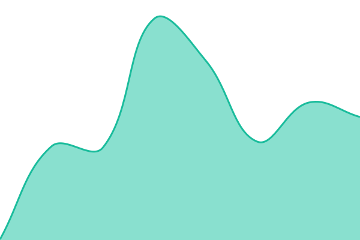

# [📈 Live Status](https://Vistry.github.io/status): <!--live status--> **🟥 Complete outage**

This repository contains the open-source uptime monitor and status page for [Vistry](vistry.ai), powered by [Upptime](https://github.com/upptime/upptime).

With [Upptime](https://upptime.js.org), you can get your own unlimited and free uptime monitor and status page, powered entirely by a GitHub repository. We use [Issues](https://github.com/Vistry/status/issues) as incident reports, [Actions](https://github.com/Vistry/status/actions) as uptime monitors, and [Pages](https://Vistry.github.io/status) for the status page.

<!--start: status pages-->
<!-- This summary is generated by Upptime (https://github.com/upptime/upptime) -->
<!-- Do not edit this manually, your changes will be overwritten -->
<!-- prettier-ignore -->
| URL | Status | History | Response Time | Uptime |
| --- | ------ | ------- | ------------- | ------ |
|  [Eva Insights](https://insights.eva.vistry.ai) | 🟥 Down | [eva-insights.yml](https://github.com/Vistry/status/commits/HEAD/history/eva-insights.yml) | 

 157ms
     
 | 

<a href="https://Vistry.github.io/status/history/eva-insights">99.98%</a>
    

|  [Eva People](https://people.eva.vistry.ai) | 🟥 Down | [eva-people.yml](https://github.com/Vistry/status/commits/HEAD/history/eva-people.yml) | 

 187ms
     
 | 

<a href="https://Vistry.github.io/status/history/eva-people">99.99%</a>
    

|  [Eva Insights API](https://api.insights.eva.vistry.ai/api/health) | 🟥 Down | [eva-insights-api.yml](https://github.com/Vistry/status/commits/HEAD/history/eva-insights-api.yml) | 

 223ms
     
 | 

<a href="https://Vistry.github.io/status/history/eva-insights-api">100.00%</a>
    

<!--end: status pages-->

[**Visit our status website →**](https://Vistry.github.io/status)

## 📄 License

- Powered by: [Upptime](https://github.com/upptime/upptime)
- Code: [MIT](./LICENSE) © [Anand Chowdhary](https://anandchowdhary.com)
- Data in the `./history` directory: [Open Database License](https://opendatacommons.org/licenses/odbl/1-0/)
